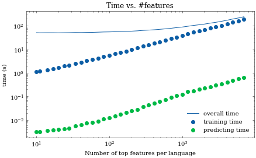
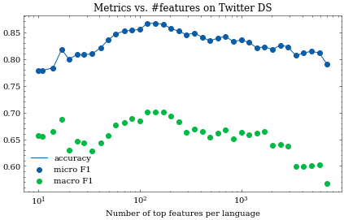
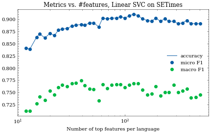
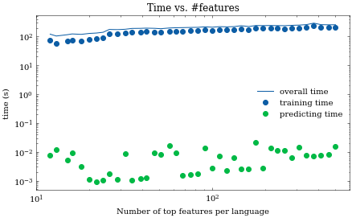

# task4

The purpose of this task is to start working on BCMS variety identification.

Datasets used:
* setimes{bs,hr,sr}
* Denis' tweets
* CLARIN webcrawls.

# Data preparation - setimes dataset

My plan was to extract the documents from the `setimes` files. This would be done by combing through and searching for the delimiter that separated the articles:

```
[Name of the journalist] za Southeast European Times -- [date]
``` 

This proved tricky, because this separator does not appear at the same rate in the file pairs, e.g. the string count for `' za Southeast European Times '` varies quite a bit:
| file                 | occurences |
| -------------------- | ---------- |
| setimes.bs-hr.bs.txt | 3220       |
| setimes.bs-hr.hr.txt | 3190       |
| setimes.bs-sr.bs.txt | 2890       |
| setimes.bs-sr.sr.txt | 2866       |
| setimes.hr-sr.hr.txt | 4471       |
| setimes.hr-sr.sr.txt | 4482       |

I had found out that the most equal delimiter was `'Southeast European Times'`:

| file                 | occurences |
| -------------------- | ---------- |
| setimes.bs-hr.bs.txt | 3377       |
| setimes.bs-hr.hr.txt | 3377       |
| setimes.bs-sr.bs.txt | 3047       |
| setimes.bs-sr.sr.txt | 3046       |
| setimes.hr-sr.hr.txt | 4774       |
| setimes.hr-sr.sr.txt | 4773       |

SInce the goal of this task is variety classification and not macine translation, it will be presumed the precise structure of the documents does not matter much and no one-to-one sentence mapping will be performed.

Once the data was processed more properly and finer details were included in the search, the results are as follows:

| Searched for  `{name} za Southeast European Times {rest}\n` | count |
| ----------------------------------------------------------- | ----- |
| setimes.bs-hr.bs.txt                                        | 3222  |
| setimes.bs-hr.hr.txt                                        | 3192  |
| setimes.bs-sr.bs.txt                                        | 2892  |
| setimes.bs-sr.sr.txt                                        | 2869  |
| setimes.hr-sr.hr.txt                                        | 4473  |
| setimes.hr-sr.sr.txt                                        | 4485  |

| Searched for `{beginning} Southeast European Times {end}\n` | count |
| ----------------------------------------------------------- | ----- |
| setimes.bs-hr.bs.txt                                        | 3230  |
| setimes.bs-hr.hr.txt                                        | 3217  |
| setimes.bs-sr.bs.txt                                        | 2900  |
| setimes.bs-sr.sr.txt                                        | 2891  |
| setimes.hr-sr.hr.txt                                        | 4505  |
| setimes.hr-sr.sr.txt                                        | 4510  |

I also examined lines that were not being picked up by my analysis:
* Nataša Radić for Southeast European Times iz Zagreba -- 03/09/08
* Da bismo bolje izašli ususret vama -- našim čitaocima -- Southeast European Times je u oktobru i novembru 2007. obavio internet anketu.
* Za Southeast European Times iz Istambula izvještava Ozgur Ogret -- 22/03/12
* Građani Kosova koje je intervjuirao Southeast European Times izrazili su različite poglede na najnovija dešavanja.
* Internet stranica Southeast European Times je glavni izvor vijesti i informacija o jugoistočnoj Evropi na deset jezika: albanskom, bosanskom, bugarskom, hrvatskom, engleskom, grčkom, makedonskom, rumunskom, srpskom i turskom.
* Cilj internet stranice Southeast European Times je da ponudi tačne i uravnotežene informacije o događanjima u Jugoistočnoj Evropi, sa pogledom u budućnost.
* Ayhan Simsek Southeast European Times -- 03/09/07
* Goran Trajkov for Southeast European Times iz Skoplja - 03/06/09

I implemented a regex search to get as much complete data as possible, focusing on the format that I deemed most likely to accurately catch all signatures. The results dissapointed a bit:

### regex: `Southeast European Times .*-- \d\d/\d\d/\d\d`

| file                 | counts |
| -------------------- | ------ |
| setimes.bs-hr.bs.txt | 2940   |
| setimes.bs-hr.hr.txt | 2596   |
| setimes.bs-sr.bs.txt | 2619   |
| setimes.bs-sr.sr.txt | 1684   |
| setimes.hr-sr.hr.txt | 3179   |
| setimes.hr-sr.sr.txt | 2566   |

### regex: `([\w+]|[|Za|za|for|For]|^) Southeast European Times .*[-\-|–] \d\d/\d\d/\d\d`
| file                 | counts |
| -------------------- | ------ |
| setimes.bs-hr.bs.txt | 3085   |
| setimes.bs-hr.hr.txt | 3066   |
| setimes.bs-sr.bs.txt | 2763   |
| setimes.bs-sr.sr.txt | 1817   |
| setimes.hr-sr.hr.txt | 4342   |
| setimes.hr-sr.sr.txt | 3395   |

The fluctuations between text pairs is gigantic, so I decided to go forward with the second implementation, where I used `parse` library to search for `{beginning} Southeast European Times {end}\n` and where the counts agree to 0.4% or better.

When I joined the data into a dataset with proper `fasttext` formatting I also created a shuffled file which will be used to produce train-test data. I trained my first model with this batch which produced suspiciously good precisions and recalls of 99%. When visually inspecting the data I noticed there were a few repeated lines, possibly because the same short document appeared in many dataset pairs. I removed those. The training was repeated and again the results were evaluated with the built-in method, yielding precision and recall of 99%.

# Data preparation - twitter

As demonstrated in the notebook `3del.ipynb` we have 1000 twitter users crawled, but only 614 are annotated. SO far only these 614 will be used in the examinations.

Functions to remove mentions, URLs, and hashtags have been prepared. Furthermore, I saw a lot of the tweets were retweets, which in plaintext manifests as prefix:
```
RT @celava_ti_mama: ...
```
I decided to include these tweets in the dataset for now as I suspect the majority of the Twitter users mostly retweet tweets in their own language. The aforementioned prefix will be stripped. The processed data was saved as a json file containing usernames, their annotated language and a list of all the tweets.

I later found that some tweets had this tag in the middle, probably indicating a retweet with a comment. I will have to deal with this later.

# Model training and analysis 

After a model was trained in fasttext I used it briefly on sample data. I checked the data distributions by language and it is interesting:


I will preserve the data as is for the time being. In the future the discrepancy in the SETIMES data could be corrected by including the BS data instances twice to roughly even the ratios of languages. This of course would not work for Montenegrin tweets, for which the only available datasource is the twitter dataset. Even after CLARIN webcrawls will have been included the situation will be miserable for Montenegrin language.

After evaluating the model by hand on test data (as opposed to the results of fasttext built-in methods) I again noticed unusually high performance:

```
Accuracy: 0.997
F1 score: 0.996
```

For this result I used the model, trained on SETIMES train data, and predicted the language of the SETIMES test data.

When I used the same model on twitter data, the metrics were more modest:

```
Accuracy: 0.375
F1 score: 0.246
```

I also prepared a preliminary version of visualization for classification results, which in its current form is not yet interactive, but it is offering some insight into the working of the algorithm nonetheless.


It can be seen that the most indicative words are usually not semantic word variants, but instead stop words commonly used in all three languages. This perhaps should not be surprising, as some BCMS variants differ also in syntactic uses of the language, expressed with combination of these stopwords.

I suspect lexical differences might also be captured and visualized by using a _proper_ tokenizer, but this might be difficult to get from fasttext.

# Corrections after mondays meeting

The SETIMES dataset must be structured in a more correct fashion that prevents data leakage. 

I shall repeat the processing in new IPython notebook for reproducibility, but previously used data files will be overwritten. 

I encountered some problems with connectivity that stemmed from the lack of diskspace due to all the clarin web crawl data. They have temporarily been deleted.

As per the weekly meeting I will prepare a train-dev-test split in the SETIMES dataset. For this I counted the lines in all three relevant files:

```
setimes.bs-hr.hr.txt 138402 
	split 1: 110721, split 2: 124561
setimes.bs-sr.sr.txt 135945 
	split 1: 108756, split 2: 122350
setimes.bs-sr.bs.txt 135945 
	split 1: 108756, split 2: 122350
```

To identify the same place I checked the 110721-st line in the first file:
```
$ sed -n '110721p' < ../../Varieties/BCMS/setimes.bs-hr.hr.txt
Kada je list The Economist pozvao birače na potporu oporbenoj CHP na nedavno održanim općim izborima u Turskoj, premijer Recep Tayyip Erdogan naznačio je da je za to možda kriv Izrael.
```

I identified the beginning of the document, which is shown here:

```
Budući da se Srbija sprema za opće izbore sljedeće godine, postoji sve veći pritisak na političare i kandidate da razviju svijest o snazi Facebooka.
S obzirom na neizvjesne utrke i žestoku kampanju koja slijedi, sposobnost korištenja društvenih medija mogla bi biti odlučujući čimbenik.
<--- DOCUMENT BORDER --->
Zapadni mediji i Erdogan: Odljubljivanje? 
Godina 2011. mogla bi biti upamćena kao godina u kojoj su se zapadni mediji ‘odljubili’ od turske vladajuće AKP.
Što se promijenilo?
Alexander Christie-Miller za Southeast European Times iz Istanbula – 21/06/11
Neke zapadne medijske kuće nedavno su se okrenule protiv premijera Erdogana. [Reuters]
Kada je list The Economist pozvao birače na potporu oporbenoj CHP na nedavno održanim općim izborima u Turskoj, premijer Recep Tayyip Erdogan naznačio je da je za to možda kriv Izrael.
```

In Bosnian dataset the same document is identified here:
```
Sa pripremama za opće izbore naredne godine u Srbiji, dolazi do povećanog pritiska na političare i kandidate da budu obavješteniji po pitanju Facebooka.
S predstojećim tijesnim utrkama i oštrim kampanjama, sposobnost zauzdavanja društvenih medija mogla bi predstavljati odlučujući faktor
<--- DOCUMENT BORDER --->
Zapadni mediji i Erdogan: ljubav prestaje?
Godina 2011. mogla bi biti zabilježena kao godina kad su zapadni mediji 'prestali s ljubavlju' prema vladajućoj turskoj stranci AKP.
Šta je pošlo nakrivo?
Alexander Christie-Miller za Southeast European Times iz Istanbula – 21/06/11
Neke zapadne medijske kuće nedavno su se okrenule na premijera Erdogana. [Reuters]
Kad je časopis The Economist glasače pozvao da podrže opozicionu CHP na nedavnim općim izborima u Turskoj, premijer Recep Tayyip Erdogan nagovijestio je da bi za to mogao biti kriv Izrael.
```

And in Serbian:

```
S obzirom da se Srbija sprema za opšte izbore sledeće godine, sve je veći pritisak na političare i kandidate da postanu svesniji Fejsbuka.
S obzirom na tesne trke i žestoku kampanju koja sledi, sposobnost da se iskoriste društveni mediji mogla bi da bude odlučujući faktor.
<--- DOCUMENT BORDER --->
Zapadni mediji i Erdogan: Odljubljivanje?
Godina 2011. mogla bi da se pamti kao godina u kojoj su se zapadni mediji ‘odljubili’ od turske vladajuće AKP.
Šta se promenilo?
Neke zapadne medijske kuće nedavno su se okrenule preotiv premijera Erdogana. [Rojters]
Kada je magazin Ekonomist pozvao birače da podrže opozicionu CHP na nedavno održanim opštim izborima u Turskoj, premijer Redžep Tajip Erdogan nagovestio je da je za to možda kriv Izrael.
```

In a similar fashion the second split has been identified in all three datasets. For reproducibility they are logged below:

| split | hr     | bs     | sr     |
| ----- | ------ | ------ | ------ |
| 1     | 110716 | 110716 | 108659 |
| 2     | 124549 | 124549 | 112302 |

Special care was taken to prevent dual inclusion of the lines, as `sed -n '1,2' file` will print first and second line. The data was split and stored in the interim directory, awaiting further processing (i.e. automated document splitting by the existing heuristic algorithm).

Searching for:  {beginning} Southeast European Times {end}
| filename     | count |
| ------------ | ----- |
| hr_train.txt | 2577  |
| bs_train.txt | 2591  |
| sr_train.txt | 2289  |
| hr_dev.txt   | 328   |
| bs_dev.txt   | 327   |
| sr_dev.txt   | 307   |
| hr_test.txt  | 312   |
| bs_test.txt  | 312   |
| sr_test.txt  | 295   |

Searching for:  {beginning}Southeast European Times{middle}{dd:d}/{mm:d}/{yy:d}

| filename     | count |
| ------------ | ----- |
| hr_train.txt | 2495  |
| bs_train.txt | 2518  |
| sr_train.txt | 1455  |
| hr_dev.txt   | 319   |
| bs_dev.txt   | 323   |
| sr_dev.txt   | 212   |
| hr_test.txt  | 305   |
| bs_test.txt  | 306   |
| sr_test.txt  | 183   |

After some examination, particularly of the Serbian dataset, it was found that the following works quite well:

Searching for:  {beginning}Southeast European Times{middle}{dd:d}{sep1}{mm:d}{sep2}{yy:d}{end}
| filename     | count |
| ------------ | ----- |
| hr_train.txt | 2557  |
| bs_train.txt | 2557  |
| sr_train.txt | 2261  |
| hr_dev.txt   | 326   |
| bs_dev.txt   | 326   |
| sr_dev.txt   | 308   |
| hr_test.txt  | 310   |
| bs_test.txt  | 309   |
| sr_test.txt  | 295   |

After this splitting has been found I proceeded with training a fasttext model. Given that we also prepared a `dev` split we can use it to optimize fasttext hyperparameters. As before the optimization time was capped at 600 seconds. Only SETIMES dataset was used for the training, validation and evaluation. Before tweaking the tokenization parameters the results are as follows:

```
Accuracy: 0.989
F1 score: 0.989
```

In the next run I increased the maximal number of character n-grams to 10, but this did not improve the metrics:

```
Accuracy: 0.989
F1 score: 0.989
```
My next attempt was increasing the wordNgram parameter to 4, which might cover some syntactical differences. Interestingly, the model actually performed way worse: Accuracy: 0.475
F1 score: 0.382

# Addendum 2021-12-28T08:18:17

I revisited the twitter dataset and discovered I can clean it better. First I improved the retweet text replacing function, and then I checked what characters appear in the tweets. It is concearning. I extract 1170 different characters, other than normal latin characters also a great deal of emojis, some asian characters, and some raw unicode characters (e.g. '\U000fe330', '\x94',...) These will have to be removed. I counted their occurances and found that the frequency dropps off radically fast, so most of the text is ok. See [file](/home/peterr/macocu/taskB/task4/8_counts_of_original_tweet_characters.csv).

I found a snippet that only allows latin characters, which includes "exotic" letters like `'Šđßå'`, but filters out math symbols, currency characters, emojis and asian characters. The preprocessing will be performed anew and since the preprocessing takes a while and it's a breeding ground for bugs, I suggest the data be split and saved.

The problem with the preprocessing as implemented is that the results are now quite weird; emoticons like `:D` now become just `D` and the punctuation is removed. 

Summarized approaches and problems:
* `import regex; result = regex.sub(u'[^\p{Latin}]', u'', tweet)`: removes the puctuation as well
* `re.sub(u'[^\x00-\x7F\x80-\xFF\u0100-\u017F\u0180-\u024F\u1E00-\u1EFF]', u'', tweet)`: does not remove math symbols and similar chars.

I opted for option 2. I pickled the dictionary containing the tweets as [/home/peterr/macocu/taskB/data/final/twitter_full_ds.pickle](/home/peterr/macocu/taskB/data/final/twitter_full_ds.pickle).


# Addendum 2021-12-28T11:09:01


I also noticed fasttext would not work if string to be predicted contains newlines. I added this newline removal to the preprocessing pipeline and saved the new data.

I repeated the finetuning on SETimes data which works like a charm:
```
Accuracy: 0.991
F1 score: 0.991 (macro)
```

With the model thus obtained I predicted the language of the Twitter dataset. It did not go as flawlessly:
```
Macro f1: 0.262
Micro f1: 0.42
Accuracy: 0.42
```


To discuss with Nikola:
* Future steps
* ~~I deleted the webcrawl data in one episode of desperately cleaning the disk to assure training, can I get the link again? ~~ Found the [link](http://hdl.handle.net/11356/1426) Now we can use it.

Reminder of where we left off:
> what is with montenegrin? how is it classified? can we somehow synthesize data for that category?
> 
> can we somehow visualise the classifier decisions, might be very useful for understanding what we have and what we need
> 
> what is the setup that will make good classifiers for all three (news, web, twitter)?
> 
> is the classification over twitter data better if mentions, hashtags, urls are removed?

For now I can answer the following:
* Montenegrin is pretty much randomly classified. I don't think we'll be able to synthesize anything with fasttext, shall we go to transformers?
* We can visualize classifier decisions. This has been already demonstrated with Lime in October, and the same framework can be extended even further.
* That is the final problem.

# Meeting notes 2021-12-28T13:49:17

* Classify `users`, not individual tweets! Use the same model.
* Get also tweet count for each user. Should be O(100) or more.
* After this: we'll start with larger corpora (linked above). Think about efficient preprocessing and token importance calculation. Google `true casing`, but probably we won't have to do that here as we have lots of data.

# Addendum 2021-12-28T18:52:51

I repeated the analysis on user level and it is muuch better :) 

```
Macro f1: 0.379
Micro f1: 0.707
Accuracy: 0.707
```


I also checked the stats on the number of the users and as Nikola foretold, we always have at least 100 tweets for each user, so we suspect we have a solid sample.

```
Tweets per user:
count     614.000000
mean      635.615635
std       430.146903
min       100.000000
25%       280.000000
50%       489.000000
75%       925.750000
max      1779.000000
```


# Addendum 2021-12-29T11:55:13

I downloaded and unzipped all the files to `~/macocu/taskB/data/raw`.

Filesizes:
* SR: 3 GB
* HR: 7.4 GB
* CNR: 558 MB
* BS: 1.6 GB


Memos on preprocessing:
* Transliteration?
* Splitting on blank lines: either `csplit`, `sed`, or with python.
* Delete all numbers.
* Delete all words that contain any capital letters.
* Delete all punctuation.

These steps can't be guaranteed to be commutative (e.g.: line `USLUGE KOMORE` would be replaced with a single space, which could be picked up as a blank line if implementation is not precise).

As fasttext can't process multiline input it would also be a good idea to squash documents into a single line.


# Meeting notes 2021-12-29T13:29:00

* use python to preprocess crawl data
* transliterate cnrwac
* ignore tokens with less than 20 occurences for now
* see skype chat for the idea of token frequency dictionary
* start with toy samples, not the entire dataset
* don't lose time with punctuation removal, should work also with the DS as is. Might repeat the calculation later to check differences.
* we are after good results on long documents, don't worry about edge cases


```
Nikola, 1:31 PM
dict={}
for token in line.split():
if token in dict:
add to dict
elif token satisfies regex:
add to dict
regex - low-cased alphabet ([a-zšđčćž])
O(1)
\w\D
Nikola, 1:42 PM
d[k]=d.get(k,0)+1
HR-SR-feat-candidates
SR-HR-feat-candidates
```

Target: get list of strongest features for CR to discriminate against SR and vice versa, and expand this to all combinations.

# Addendum 2021-12-29T14:26:12

So, let's get started. I'm opening a new notebook to sort it out. I started by creating a toy dataset with the first 10000 lines from all files to test, but this will have to be increased in the future to get better distribution estimates.


# Addendum 2021-12-29T16:10:37

I prepared the second part of the machinery, namely a script to generate the frequency dictionary. On the toy corpus it takes about 11s to get generated, so I think this will not be the bottleneck. Upon brief inspection I noticed that we get some unwanted behavior, specifically stuff like:

```
 'vještine\n': 80,
 'nastali': 200,
 'razni': 224,
 'stilovi\n': 4,
 ```

This will be corrected within the frequency extractor itself.

# Addendum 2021-12-29T17:54:58

The frequency extractor has been corrected and for the toy corpora the resulting jsons are ready and added to the repo.


# Addendum 2021-12-30T08:07:31

I started with the combination of HR <-> SR toy corpora.

For the most important features that distinguish Croatian toy corpus from the Serbian, I get the following table (only the first 30 items are shown):

|              |   HR_SR |      SR_HR |
| :----------- | ------: | ---------: |
| kn           | 179.556 |  0.0055693 |
| sustav       | 150.153 | 0.00665988 |
| sustava      | 149.265 | 0.00669948 |
| suradnji     | 125.406 | 0.00797411 |
| natjecanja   | 115.761 |  0.0086385 |
| lipnja       | 110.973 | 0.00901122 |
| rujna        |  110.86 | 0.00902038 |
| okoliša      | 110.521 | 0.00904808 |
| tvrtke       | 109.443 | 0.00913722 |
| svibnja      | 109.307 | 0.00914858 |
| ožujka       | 109.117 | 0.00916446 |
| travnja      | 107.848 | 0.00927227 |
| udruge       | 105.651 | 0.00946512 |
| listopada    | 103.449 |  0.0096666 |
| uvjetima     | 84.6988 |  0.0118065 |
| veljače      | 84.0536 |  0.0118972 |
| gospodarstva | 82.3719 |  0.0121401 |
| sudionika    | 81.2523 |  0.0123073 |
| primjerice   | 80.2788 |  0.0124566 |
| udruga       | 80.1087 |   0.012483 |
| tjedna       | 78.8446 |  0.0126832 |
| kuna         | 78.6973 |  0.0127069 |
| županije     | 78.1412 |  0.0127974 |
| sudjelovanje | 77.9331 |  0.0128315 |
| milijuna     | 77.1661 |  0.0129591 |
| tijekom      | 76.9481 |  0.0129958 |
| siječnja     |  76.888 |  0.0130059 |
| natjecanje   | 76.3397 |  0.0130993 |
| glazbe       | 75.3042 |  0.0132795 |
| tvrtki       | 75.1313 |    0.01331 |

Mutatis mutandis, we can get the importances of Serbian tokens in comparison with the Croatian corpus:

|             |   SR_HR |      HR_SR |
| :---------- | ------: | ---------: |
| rešenja     | 203.882 |  0.0049048 |
| odsto       | 195.017 | 0.00512775 |
| opštine     | 193.647 | 0.00516403 |
| preduzeća   | 186.179 | 0.00537119 |
| gde         | 167.978 | 0.00595317 |
| deo         | 164.964 | 0.00606195 |
| cena        | 164.217 | 0.00608949 |
| mesta       | 163.866 | 0.00610255 |
| cene        | 163.412 | 0.00611949 |
| evra        | 157.018 | 0.00636869 |
| časova      | 155.753 | 0.00642043 |
| predsednika | 154.401 | 0.00647663 |
| saradnji    | 152.997 | 0.00653608 |
| vreme       | 139.484 | 0.00716929 |
| meseca      | 138.417 | 0.00722453 |
| predsednik  | 134.998 | 0.00740753 |
| dece        | 132.495 | 0.00754746 |
| meseci      | 125.721 | 0.00795413 |
| uslovima    | 124.393 | 0.00803905 |
| uvek        |  122.46 | 0.00816596 |
| delu        | 121.249 | 0.00824752 |
| posle       | 119.203 | 0.00838903 |
| dve         | 117.117 | 0.00853847 |
| korišćenje  | 114.489 | 0.00873448 |
| decu        | 112.382 |  0.0088982 |
| mesto       |  111.11 | 0.00900005 |
| čoveka      | 110.924 | 0.00901519 |
| zahteva     | 109.001 | 0.00917422 |
| dela        | 108.295 | 0.00923403 |
| saradnje    | 106.124 | 0.00942292 |

What we should improve is replacing all `NaN` values that occur because a token was not present in corpus and repeat the analysis to get more realistic numbers. I did this, but this specific example did not change. 

All of the information for HR_SR is contained in one column, if we wanted to extract values for SR_HR comparison, we need only to invert the values in the HR_SR column. This means we need to populate only one half of the matrix {HR, SR, BS, CNR} × {HR, SR, BS, CNR}, so that is 6 combinations, but for simplicity I calculated them all nonetheless.

Let's check how the distributions of token importances look like: 


We can see that for more different lanugages we get more highly ranked tokens, which seems logical. For closely-related languages (HR-BS) most of the importances are low and we get none that would be ranked highly.

For a sense of magnitude I also include a full picture of the distribution:


What we saw now was not particularly difficult, and I see no reason for sticking with the toy dataset. 

Intuitively we can see that the neutral point for importance would be around 1. We can see this if we check the values for the token "i", which should be non-deterministic for all languages:

```
HR_SR     0.985521
SR_HR     1.014692
HR_CNR    0.958717
CNR_HR    1.043060
HR_BS     1.036843
BS_HR     0.964466
BS_SR     0.950502
SR_BS     1.052076
BS_CNR    0.924650
CNR_BS    1.081490
CNR_SR    1.027958
SR_CNR    0.972802
```

So the most important features are the ones with either big ranking, swaying the decision toward a language, but also the ones with really small ranking, whose occurrence would indicate this is the other language (`blacklisted words`).

With this in mind I checked the distribution again, this time in log-log scale, so that we would catch also the distribution in the blacklist region of the plot:


# Meeting notes 2021-12-30T14:12:16


* Use two Web Crawl subsets: one for feature extraction, one for clf training.
* Target nr of features: 5k, but make it a parameter.
* Take the highest ranking features greedily for every of the 12 combinations.
* Make a pipeline using CountVectorizer and SVM clfs
* Eval on SETimes 
* Fiddle with target nr of parameters to optimize it.


# Addendum 2021-12-31T09:33:31

First I shall prepare two new datasets; first 1M lines should be used for feature selection and the last 1M should be used for classifier training. I did this in `10_preprocessing.ipynb` and created the tail files in the same fashion as before.


# Addendum 2022-01-03T10:12:44


I implemented a pipeline that preprocessed the data and allowed me to use the web corpus as training dataset for a classifier. I used the top 5k words from every language as a vocabulary for `CountVectorizer` from `sklearn.feature_extraction.text`. I noticed that SVC takes a loong time to train, so after 30 minutes of training I iterrupted it and opted for a NaiveBayes classifier. For evaluation dataset I used the Twitter dataset, because it has Montenegrin instances as well. This will be soon changed to SETimes, but there the preparation is a bit lenghtier.

For my first result I obtain the following:

```
Clf: Naive Bayes
Train: tail_pp
Test: Twitter
remarks: 5k tokens, default Count Vectorizer
Macro f1: 0.561
Micro f1: 0.785
Accuracy: 0.785
```

We see improvements on all metrics, but a look at the Confusion Matrix eveals montenegrin is still not recognised properly:


Short training times with Naive Bayes (3 min instead of >30min for SVM) allows me to play around with some parameters. I tried using binary CountVectorizer, meaning that we do not care for the real counts, only wheather or not the token occurs in the instance text. This is also a neat opportunity to measure the runtime for the entire pipeline (finding top N most frequent lexems, fitting the Count Vectorizer, transforming the train and test instances, training the classifier, and finally calculating performance metrics and plotting the confusion matrix.) In just 3 min 14s the code is run, and the results are even better:

```
Clf: Naive Bayes
Train: tail_pp
Test: Twitter
remarks: 5k tokens, BINARY Count Vectorizer
Macro f1: 0.608
Micro f1: 0.816
Accuracy: 0.816
```


From this we postulate that using binary vectorizer is better than using the actual token counts.

I will proceed with using the SETimes dataset as evaluation dataset. I expect the training times to get a bit longer due to the linear nature of NB classifier, the results will likely be better because we have no montenegrin, so the metrics might be higher due to that.

It turned out I was sorely mistaken; even though we have much more data, the pipeline only needed 3min10s to run.
```
Clf: Naive Bayes
Train: tail_pp
Test: SETimes
remarks: 5k tokens, BINARY Count Vectorizer
Macro f1: 0.826
Micro f1: 0.816
Accuracy: 0.826
```


I ran the pipeline once more to see what happens if I set the return type of the CountVectorizer to `np.bool`, which is definitely less demanding in terms of memory space, but maybe we can also improve the speed of the computation this way. It turns out I was sorely mistaken, because I got

```python
MemoryError: Unable to allocate 65.5 GiB for an array with shape (343841, 25562) and data type float64
```
Clearly something is happening under the hood that I should mitigate, but for now let's just remember the old proverb:
> The root of all evil is premature optimization.

I continued with making a function that would accept `N` and calculate the metrics automatically. This proved more difficult than imagined due to the fact that I would often encounter the same error as the one above.

As it turned out, I needed only to restart the kernel and it worked flawlessly. I ran the optimization in logarithmically spaced `N`, and after seeing the conclusions I repeated it once more with simmilar, but not equal parameters.

The second run confirmed the conclusions of the first run; the optimal number of tokens per language is an order of magnitude lower than we suspected before, as these plots clearly show:


I also monitored the time needed to train, predict and the overall time. We can see that overall time has a baseline, owing to the fact that the vocabulary is constructed each time the training is run. ~~This could be minimised to a fraction of its current value with caching.~~ It turns out the vocabulary is not the bottle neck at all, instead the tokenization/vectorization is the process that dictates the runtime.

As far as the times for training and predicting is concearned, the classifier behaves as advertised, with both times increasing linearly with the number of top features per language.




It should be noted that as soon as I approach 10k top tokens per language pair, I generate a CountVectorizer so massive, that it does not fit into the memory any more, meaning that the right edge of the plots is dictated by hardware limitations.

On Twitter dataset the performance is simmilar, albeit less pronounced than that of SETimes. For completeness I repeated the scan for optimal `N` with lower limits, to hopefully convincingy prove there exists a maximum for micro- and macro-F1.




This time the repeated experiments proved to be far uglier, less self-consistant and far less continuous as the previous batch. But we clearly see there is some optimal value somewhere between 1e2 and 1e3 features per language pair. ~~The experiments will be repeated in the future.~~ New plots are nicer. They clearly show the optimal number of params is lower for Twitter dataset than for SETimes, probably owing to the different writing styles.


# Addendum 2022-01-04T09:04:04
I rewrote the code for optimization on SVC. Even with only 10 features per language pair the SVC training takes a long time, and if the results won't be significantly better I suggest we stick with NB. As of right now the training for mere 10 features per language is at ~~11~~ ~~30~~ ~~66~~ ~~73~~  ~~129~~ ~~167~~ ~~205~~ ~~317 minutes~~ 8 hours. I stopped it at this point.


I researched a bit and found that the temporal complexity of SVC is  `O(n_samples^2 * n_features) `, meaning that in our case we do have a linear increase with the number of features, but the majority contribution will be due to the number of samples.

I found another implementation, `sklearn.SVM.LinearSVC`, which supposedly scales better. It turns out to be true, the iteration for 10 top features per language pair halted after 2 minutes, as opposed to more than an hour for the vanilla SVC. It was raising some ConvergenceWarnings though, so we will have to check the results to see if they are sensible.

After the first scan through `N` space was completed, I checked the preliminary results. They are lower than those achieved with Naive Bayes, but they do exhibit the same profile, with the metrics being highest around O(500) features.


As far as time is concearned, the overhead due to count vectorizer initiation is now barely visible. The vast majority of time is dedicated to training. Prediction times are simmilar to Naive Bayes.

The scan was repeated again in approximately the same range. The results are pretty self-consistant. The optimal `N` seems to be 125.






On twitter dataset, however, the (Linear) SVC performs _better_ than Naive Bayes:


Evaluations on twitter dataset also show that the optimal `N` parameter is closer to the one we estimated for Naive Bayes. 

# Summary:

Let's sum up our metrics in a concise manner in a table:

| clf         | dataset | optimal `N` | max acc |
| ----------- | ------- | ----------- | ------- |
| Naive Bayes | SETimes | 517         | 0.9     |
| Naive Bayes | Twitter | 117         | 0.85    |
| Linear SVC  | SETimes | 125         | 0.75    |
| Linear SVC  | Twitter | 125         | 0.91    |


# Addendum 2022-01-05T10:07:27

I tried optimizing hyperparameters for the part 15: training a plain SVC on SETimes. I never obtained performance remotely comparable to LinearSVC ( clasifier trained in less than a few minutes).


# Chat with Nikola 2022-01-07T08:01:58


We are to prepare a separate test dataset with corpus data as well. We can take 10% of the vocabulary/classifier data and evaluate that.


We also have to evaluate coverage of the vocabulary -> percentage of documents that are not covered by any feature.

After investigating the splitting procedure, i found this disconcerting distribution of labels:


I thought that there was something buggy in my procedure, but alas, after investigating, I found that the files are split correctly, meaning that the line count of the files looks like this:

```bash
(base) 2022-01-07 T 10:47:48~/macocu/taskB/data/interim$ wc -l *tail_pp
  1000000 bswac_tail_pp
  1000000 cnrwac_tail_pp
  1000000 hrwac_tail_pp
  1000000 srwac_tail_pp
```
The distribution simply means that we have much shorter documents in montenegrin, yielding more instances. We can therefore predict also that the coverage will be lower for montenegrin, since the average document length will be lower.


# Addendum 2022-01-07T12:24:32

First results are in. 

Interestingly the optimal number of tokens per language seems to be higher than before: initial estimate is around ~~1000~~ 1172 tokens per language pair.

The in-domain accuracy is the lowest recorded, at best we achieve 0.66 accuracy. 


Coverage is increasing with richer vocabularies. I measure it as the average number of distinct vocabulary tokens that are found in the instance string. It seems reasonable that the number of tokens found is increasing with longer vocabularies.

What could be the issue with poor in-domain results?
* Training split was smaller, but only for 10%
* Poorly performing montenegrin is overly-represented, which could explain lower performance

I also performed LinearSVC classifier training on the same dataset. The results were better, but trends indicate the optimum was not reached before running out of memory:


# Summary as of 2022-01-13T09:50:02


| clf         | dataset   | optimal `N` | max acc |
| ----------- | --------- | ----------- | ------- |
| Naive Bayes | SETimes   | 517         | 0.9     |
| Naive Bayes | Twitter   | 117         | 0.85    |
| Naive Bayes | in-domain | 727         | 0.66    |
| Linear SVC  | SETimes   | 125         | 0.75    |
| Linear SVC  | Twitter   | 125         | 0.91    |
| Linear SVC  | in-domain | > 4893       | 0.77   |


# Meeting notes 2022-01-13T10:07:42

Ideas for correcting the in-domain dataset:
* ✓ Compile per language token importances for Nikola. N=5000.
* ~~Filter out the shortest ME documents so that we get appropriately sized ME split~~
* ✓ Alternatively: Concatenate shortest documents in ME domain **with neighbours** until we get a comparable ME split.
* ✓ Implement boolean-coverage calculation: find the documents for which no token in vocabulary is present in the document text. See example below. Agregated across eval split should be percentage of instances that are not covered.
* Log the per language coverage (perhaps plot it?)

```
boolean_covegerage(instance) -> bool:
  """Return True if there are at least 3 vocab tokens in instance text """
```

## Correcting the ME subset

Before correcting let's inspect original composition of the per-language dataset:


We can see we have an unusual count of instances in ME at around 20 words. As agreed these will be joined with their neighbours. This will be done in `pandas`.

The new ME webcrawl file is `data/interim/cnrwac_tail_pp_corrected`.

## Repeating the in-domain classification

With new ME split I repeated the in-domain classification evaluation. Below is a plot of clf metrics for Naive Bayes:


And for LinearSVC:


The results are quantitatively similar to what we saw before.

# Addendum 2022-01-14T11:21:29

A new correction on the ME web data has been performed. The unusual peak at 22 words in the distribution has been explored and a boilerplate sentence was ruled to be the reason behind it. These instances were deleted. Furthermore, the shortest documents were joined with their neighbours so that the distribution starts at 20 words, to approximately match the rest of the distributions.

The new ME webcrawl file is `data/interim/cnrwac_tail_pp_corrected_2`.

I continued with rerunning the experiments with the newest corrections. The plots above will be replaced with the new version.

I started working on per-language coverage calculation and evaluation. I expect all metrics will follow the same pattern as the language-agnostic metric did. They should in any case be monotonically decreasing with `N`, because the percentage of uncovered instances can not increase if we increase `N`. 

The first results, obtained with NB classifier, confirmed my hypothesis:


The coverage will not change if we chose a diffent classifier, so this experiment was not repeated for Linear SVC. As we can see Croatian and Bosnian datasets are less covered, while Montenegrin and Serbian behave similarly and more nicely than the rest of the languages.

# Meeting notes 2022-01-14T15:07:31

* Provide Nikola with text, y_true and y_pred for the entire web evaluation dataset at N=800. Remove excess whitespace.
* Future steps: DS are to be published (not processed) and a paper is to be written about this.
