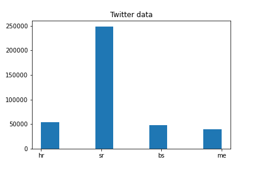

# task4

The purpose of this task is to start working on BCMS variety identification.

Datasets used:
* setimes{bs,hr,sr}
* Denis' tweets
* CLARIN webcrawls.

# Data preparation - setimes dataset

My plan was to extract the documents from the `setimes` files. This would be done by combing through and searching for the delimiter that separated the articles:

```
[Name of the journalist] za Southeast European Times -- [date]
``` 

This proved tricky, because this separator does not appear at the same rate in the file pairs, e.g. the string count for `' za Southeast European Times '` varies quite a bit:
|   file     | occurences     |     
|---|---|
|setimes.bs-hr.bs.txt |3220|
|setimes.bs-hr.hr.txt |3190|
|setimes.bs-sr.bs.txt |2890|
|setimes.bs-sr.sr.txt |2866|
|setimes.hr-sr.hr.txt |4471|
|setimes.hr-sr.sr.txt |4482|

I had found out that the most equal delimiter was `'Southeast European Times'`:

|   file     | occurences     |     
|---|---|
| setimes.bs-hr.bs.txt | 3377 |
| setimes.bs-hr.hr.txt | 3377 |
| setimes.bs-sr.bs.txt | 3047 |
| setimes.bs-sr.sr.txt | 3046 |
| setimes.hr-sr.hr.txt | 4774 |
| setimes.hr-sr.sr.txt | 4773 |

SInce the goal of this task is variety classification and not macine translation, it will be presumed the precise structure of the documents does not matter much and no one-to-one sentence mapping will be performed.

Once the data was processed more properly and finer details were included in the search, the results are as follows:

|Searched for  `{name} za Southeast European Times {rest}\n` | count |
| --- | --- |
| setimes.bs-hr.bs.txt |  3222 |
| setimes.bs-hr.hr.txt |  3192 |
| setimes.bs-sr.bs.txt |  2892 |
| setimes.bs-sr.sr.txt |  2869 |
| setimes.hr-sr.hr.txt |  4473 |
| setimes.hr-sr.sr.txt |  4485 |

|Searched for `{beginning} Southeast European Times {end}\n` | count |
| --- | --- |
| setimes.bs-hr.bs.txt |  3230 |
| setimes.bs-hr.hr.txt |  3217 |
| setimes.bs-sr.bs.txt |  2900 |
| setimes.bs-sr.sr.txt |  2891 |
| setimes.hr-sr.hr.txt |  4505 |
| setimes.hr-sr.sr.txt |  4510 |

I also examined lines that were not being picked up by my analysis:
* Nataša Radić for Southeast European Times iz Zagreba -- 03/09/08
* Da bismo bolje izašli ususret vama -- našim čitaocima -- Southeast European Times je u oktobru i novembru 2007. obavio internet anketu.
* Za Southeast European Times iz Istambula izvještava Ozgur Ogret -- 22/03/12
* Građani Kosova koje je intervjuirao Southeast European Times izrazili su različite poglede na najnovija dešavanja.
* Internet stranica Southeast European Times je glavni izvor vijesti i informacija o jugoistočnoj Evropi na deset jezika: albanskom, bosanskom, bugarskom, hrvatskom, engleskom, grčkom, makedonskom, rumunskom, srpskom i turskom.
* Cilj internet stranice Southeast European Times je da ponudi tačne i uravnotežene informacije o događanjima u Jugoistočnoj Evropi, sa pogledom u budućnost.
* Ayhan Simsek Southeast European Times -- 03/09/07
* Goran Trajkov for Southeast European Times iz Skoplja - 03/06/09

I implemented a regex search to get as much complete data as possible, focusing on the format that I deemed most likely to accurately catch all signatures. The results dissapointed a bit:

### regex: `Southeast European Times .*-- \d\d/\d\d/\d\d`

|file| counts|
|---|---|
| setimes.bs-hr.bs.txt |  2940 |
| setimes.bs-hr.hr.txt |  2596 |
| setimes.bs-sr.bs.txt |  2619 |
| setimes.bs-sr.sr.txt |  1684 |
| setimes.hr-sr.hr.txt |  3179 |
| setimes.hr-sr.sr.txt |  2566 |

### regex: `([\w+]|[|Za|za|for|For]|^) Southeast European Times .*[-\-|–] \d\d/\d\d/\d\d`
|file| counts|
|---|---|
| setimes.bs-hr.bs.txt |  3085 |
| setimes.bs-hr.hr.txt |  3066 |
| setimes.bs-sr.bs.txt |  2763 |
| setimes.bs-sr.sr.txt |  1817 |
| setimes.hr-sr.hr.txt |  4342 |
| setimes.hr-sr.sr.txt |  3395 |

The fluctuations between text pairs is gigantic, so I decided to go forward with the second implementation, where I used `parse` library to search for `{beginning} Southeast European Times {end}\n` and where the counts agree to 0.4% or better.

When I joined the data into a dataset with proper `fasttext` formatting I also created a shuffled file which will be used to produce train-test data. I trained my first model with this batch which produced suspiciously good precisions and recalls of 99%. When visually inspecting the data I noticed there were a few repeated lines, possibly because the same short document appeared in many dataset pairs. I removed those. The training was repeated and again the results were evaluated with the built-in method, yielding precision and recall of 99%.

# Data preparation - twitter

As demonstrated in the notebook `3del.ipynb` we have 1000 twitter users crawled, but only 614 are annotated. SO far only these 614 will be used in the examinations.

Functions to remove mentions, URLs, and hashtags have been prepared. Furthermore, I saw a lot of the tweets were retweets, which in plaintext manifests as prefix:
```
RT @celava_ti_mama: ...
```
I decided to include these tweets in the dataset for now as I suspect the majority of the Twitter users mostly retweet tweets in their own language. The aforementioned prefix will be stripped. The processed data was saved as a json file containing usernames, their annotated language and a list of all the tweets.

I later found that some tweets had this tag in the middle, probably indicating a retweet with a comment. I will have to deal with this later.

# Model training and analysis 

After a model was trained in fasttext I used it briefly on sample data. I checked the data distributions by language and it is interesting:




I will preserve the data as is for the time being. In the future the discrepancy in the SETIMES data could be corrected by including the BS data instances twice to roughly even the ratios of languages. This of course would not work for Montenegrin tweets, for which the only available datasource is the twitter dataset. Even after CLARIN webcrawls will have been included the situation will be miserable for Montenegrin language.

After evaluating the model by hand on test data (as opposed to the results of fasttext built-in methods) I again noticed unusually high performance:

```
Accuracy: 0.997
F1 score: 0.996
```

For this result I used the model, trained on SETIMES train data, and predicted the language of the SETIMES test data.

When I used the same model on twitter data, the metrics were more modest:

```
Accuracy: 0.375
F1 score: 0.246
```

I also prepared a preliminary version of visualization for classification results, which in its current form is not yet interactive, but it is offering some insight into the working of the algorithm nonetheless.


It can be seen that the most indicative words are usually not semantic word variants, but instead stop words commonly used in all three languages. This perhaps should not be surprising, as some BCMS variants differ also in syntactic uses of the language, expressed with combination of these stopwords.

I suspect lexical differences might also be captured and visualized by using a _proper_ tokenizer, but this might be difficult to get from fasttext.

# Corrections after mondays meeting

The SETIMES dataset must be structured in a more correct fashion that prevents data leakage. 

I shall repeat the processing in new IPython notebook for reproducibility, but previously used data files will be overwritten. 

I encountered some problems with connectivity that stemmed from the lack of diskspace due to all the clarin web crawl data. They have temporarily been deleted.

As per the weekly meeting I will prepare a train-dev-test split in the SETIMES dataset. For this I counted the lines in all three relevant files:

```
setimes.bs-hr.hr.txt 138402 
	split 1: 110721, split 2: 124561
setimes.bs-sr.sr.txt 135945 
	split 1: 108756, split 2: 122350
setimes.bs-sr.bs.txt 135945 
	split 1: 108756, split 2: 122350
```

To identify the same place I checked the 110721-st line in the first file:
```
$ sed -n '110721p' < ../../Varieties/BCMS/setimes.bs-hr.hr.txt
Kada je list The Economist pozvao birače na potporu oporbenoj CHP na nedavno održanim općim izborima u Turskoj, premijer Recep Tayyip Erdogan naznačio je da je za to možda kriv Izrael.
```

I identified the beginning of the document, which is shown here:

```
Budući da se Srbija sprema za opće izbore sljedeće godine, postoji sve veći pritisak na političare i kandidate da razviju svijest o snazi Facebooka.
S obzirom na neizvjesne utrke i žestoku kampanju koja slijedi, sposobnost korištenja društvenih medija mogla bi biti odlučujući čimbenik.
<--- DOCUMENT BORDER --->
Zapadni mediji i Erdogan: Odljubljivanje? 
Godina 2011. mogla bi biti upamćena kao godina u kojoj su se zapadni mediji ‘odljubili’ od turske vladajuće AKP.
Što se promijenilo?
Alexander Christie-Miller za Southeast European Times iz Istanbula – 21/06/11
Neke zapadne medijske kuće nedavno su se okrenule protiv premijera Erdogana. [Reuters]
Kada je list The Economist pozvao birače na potporu oporbenoj CHP na nedavno održanim općim izborima u Turskoj, premijer Recep Tayyip Erdogan naznačio je da je za to možda kriv Izrael.
```

In Bosnian dataset the same document is identified here:
```
Sa pripremama za opće izbore naredne godine u Srbiji, dolazi do povećanog pritiska na političare i kandidate da budu obavješteniji po pitanju Facebooka.
S predstojećim tijesnim utrkama i oštrim kampanjama, sposobnost zauzdavanja društvenih medija mogla bi predstavljati odlučujući faktor
<--- DOCUMENT BORDER --->
Zapadni mediji i Erdogan: ljubav prestaje?
Godina 2011. mogla bi biti zabilježena kao godina kad su zapadni mediji 'prestali s ljubavlju' prema vladajućoj turskoj stranci AKP.
Šta je pošlo nakrivo?
Alexander Christie-Miller za Southeast European Times iz Istanbula – 21/06/11
Neke zapadne medijske kuće nedavno su se okrenule na premijera Erdogana. [Reuters]
Kad je časopis The Economist glasače pozvao da podrže opozicionu CHP na nedavnim općim izborima u Turskoj, premijer Recep Tayyip Erdogan nagovijestio je da bi za to mogao biti kriv Izrael.
```

And in Serbian:

```
S obzirom da se Srbija sprema za opšte izbore sledeće godine, sve je veći pritisak na političare i kandidate da postanu svesniji Fejsbuka.
S obzirom na tesne trke i žestoku kampanju koja sledi, sposobnost da se iskoriste društveni mediji mogla bi da bude odlučujući faktor.
<--- DOCUMENT BORDER --->
Zapadni mediji i Erdogan: Odljubljivanje?
Godina 2011. mogla bi da se pamti kao godina u kojoj su se zapadni mediji ‘odljubili’ od turske vladajuće AKP.
Šta se promenilo?
Neke zapadne medijske kuće nedavno su se okrenule preotiv premijera Erdogana. [Rojters]
Kada je magazin Ekonomist pozvao birače da podrže opozicionu CHP na nedavno održanim opštim izborima u Turskoj, premijer Redžep Tajip Erdogan nagovestio je da je za to možda kriv Izrael.
```

In a similar fashion the second split has been identified in all three datasets. For reproducibility they are logged below:

|split|hr|bs|sr|
|---|---|---|---|
| 1|110716 |110716 | 108659|
|2|124549|124549|112302|

Special care was taken to prevent dual inclusion of the lines, as `sed -n '1,2' file` will print first and second line. The data was split and stored in the interim directory, awaiting further processing (i.e. automated document splitting by the existing heuristic algorithm).

Searching for:  {beginning} Southeast European Times {end}
|filename | count |
|---|---|
|hr_train.txt| 2577|
|bs_train.txt| 2591|
|sr_train.txt| 2289|
|hr_dev.txt| 328|
|bs_dev.txt| 327|
|sr_dev.txt| 307|
|hr_test.txt| 312|
|bs_test.txt| 312|
|sr_test.txt| 295|

Searching for:  {beginning}Southeast European Times{middle}{dd:d}/{mm:d}/{yy:d}

|filename | count |
|---|---|
|hr_train.txt| 2495|
|bs_train.txt| 2518|
|sr_train.txt| 1455|
|hr_dev.txt| 319|
|bs_dev.txt| 323|
|sr_dev.txt| 212|
|hr_test.txt| 305|
|bs_test.txt| 306|
|sr_test.txt| 183|

After some examination, particularly of the Serbian dataset, it was found that the following works quite well:

Searching for:  {beginning}Southeast European Times{middle}{dd:d}{sep1}{mm:d}{sep2}{yy:d}{end}
|filename | count |
|---|---|
|hr_train.txt| 2557|
|bs_train.txt| 2557|
|sr_train.txt| 2261|
|hr_dev.txt| 326|
|bs_dev.txt| 326|
|sr_dev.txt| 308|
|hr_test.txt| 310|
|bs_test.txt| 309|
|sr_test.txt| 295|

After this splitting has been found I proceeded with training a fasttext model. Given that we also prepared a `dev` split we can use it to optimize fasttext hyperparameters. As before the optimization time was capped at 600 seconds. Only SETIMES dataset was used for the training. Before tweaking the tokenization parameters the results are as follows:

```
Accuracy: 0.989
F1 score: 0.989
```

In the next run I increased the maximal number of character n-grams to 10.