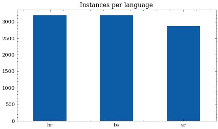

# SETimes dataset

## Dataset description

This dataset has been prepared from South Eastern Times dataset articles. It consists from 9258 instances in three languages (Croatian, Bosnian, and Serbian), with the same news in all three languages. Individual news articles have been identified automatically extracted and split based on the authors' names and dates. With this we get the following composition:

| language, split | count |
|-----------------|-------|
| hr, train       | 2557  |
| bs, train       | 2557  |
| sr, train       | 2261  |
| hr, dev         | 326   |
| bs, dev         | 326   |
| sr, dev         | 308   |
| hr, test        | 310   |
| bs, test        | 309   |
| sr, test        | 295   |

In many cases the same news is present in all three languages. The splits have been performed sequentially so that the same news in different languages stay in the same split to prevent data leakage.


## Dataset structure

Dataset is saved as a single [JSON file](SETimes.json) with the following formatting:

```
    "0":{
        "text":"Kultura i dru\u0161tvo: makedonski pravoslavci proslavili Bogojavljenje ....",
        "language":"bs",
        "split":"train"
    },
    "1": {...},
    ...
```

## Dataset composition




