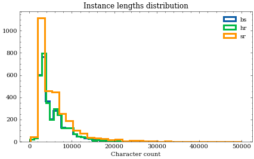

# SETimes dataset

## Dataset description

This dataset has been prepared from South Eastern Times dataset articles for the purpose of BCS variant classification. It consists from 9258 instances in three languages (Croatian, Bosnian, and Serbian). Individual news articles have been automatically identified and split. With this we get the following composition:

| language, split | text |
|:----------------|-----:|
| bs, dev         |  327 |
| bs, test        |  312 |
| bs, train       | 2556 |
| hr, dev         |  327 |
| hr, test        |  313 |
| hr, train       | 2556 |
| sr, dev         |  309 |
| sr, test        |  296 |
| sr, train       | 2262 |

In many cases the same news is present in all three languages. The splits have been performed sequentially so that the same news in different languages stay in the same split to prevent data leakage.


## Dataset structure

The [JSON file](SETimes.json) is a list of dictionaries. Each instance has the following fields:
| field      | type   | meaning                                                  |
|------------|--------|----------------------------------------------------------|
| `text`     | string | article text                                             |
| `language` | string | manually annotated language variant (`hr`, `bs` or `sr`) |
| `split`    | string | which split the instance belongs to                      |

### Sample instance
```
    {
        "text":"Kultura i dru\u0161tvo: makedonski pravoslavci proslavili Bogojavljenje ....",
        "language":"bs",
        "split":"train"
    }
```

## Dataset composition



