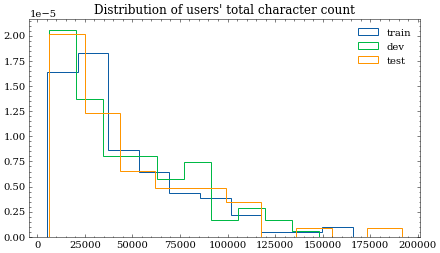

# Twitter dataset

## Dataset description

This dataset consists of 390268 tweets from 614 Twitter users. The users have been manually annotated with the BCMS variant they use. Twitter handles and URLs have been filtered from the tweets and all tweets have been transliterated from cyrillic to latin script. The intended use for this dataset is BCMS variant identification.

Per-language composition:

| language variant | count |
|:-----------------|------:|
| sr               |   394 |
| hr               |    89 |
| bs               |    75 |
| me               |    56 |

## Dataset structure
An 80-10-10 train-dev-test split has been performed on user level, meaning that all the tweets from a specific user are in a single fold. The splits are stratified by language on user level.

The [JSON file](twitter.json) is a dictionary with sequential keys. Each instance has the following fields:
| field      | type            | meaning                                                        |
|------------|-----------------|----------------------------------------------------------------|
| `user`     | string          | Twitter username                                               |
| `language` | string          | manually annotated language variant (`hr`, `bs`, `sr` or `me`) |
| `split`    | string          | which split the instance belongs to                            |
| `tweets`   | list of strings | individual tweets                                              |

### Sample instance
```
    "0":{
        "user":"danijelzv",
        "language":"bs",
        "split":"train",
        "tweets":[
            " Isto srce kao '95! ",
            " ne otkrivaj nam polo\u017eaj :-)",
            ....
            ]
        }
```

## Dataset composition

Since the stratification was performed on user level, we want to assure the individual splits have approximately the same composition. In this case character count of all the users' tweets was checked. As we see Montenegrin tweet distribution is shaped slightly differently than the rest, but since there aren't many Montenegrin users anyway, there is not much to be done.




## Known issues:

* Transliteration module transforms capital letters "Љ" and "Њ" as "Lj" and "Nj", respectively. Note the "j" in the transliteration is not capitalized.
* Some tweets are in English, consist only of smileys, or are not complete sentences (e.g. "Apuglia, Italy")
* Some tweets are clearly written by bots (e.g. "2 people followed me and 3 people unfollowed me \/\/ automatically checked by ", note how the sentence has a missing TW handle that was removed in the preprocessing).
* Certain users use a great deal of offensive words.
* If the tweet was a reply or a retweet, there is often little text remaining, sometimes as little as "haha" or "...".